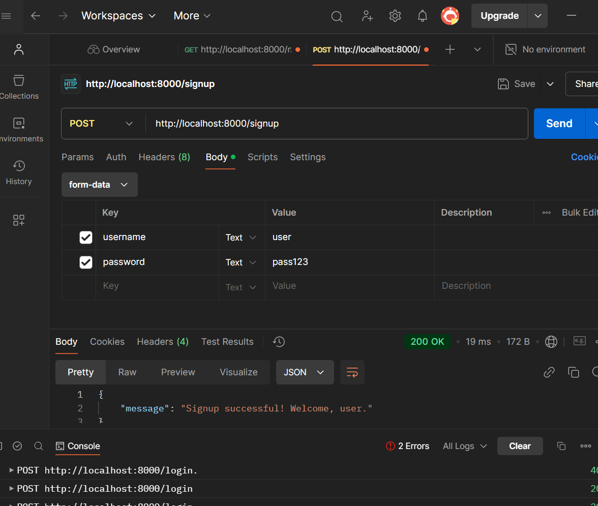

# Lilly Technical Challenge Documentation Template

# Finished Backend and Frontend Setup
 Prior to starting this project, I already had Git and Visual Studio Code installed. I set up the Python virtual environment (venv) to manage the project's dependencies, then installed all the required packages by running pip install -r requirements.txt. To ensure the backend was functioning correctly, I started the server and checked that it was running successfully by visiting http://localhost:8000/medicines in my browser. I also tested the frontend by opening the index.html file in my browser to confirm everything was loading as expected.

For the second objective, I added logic to handle empty or invalid entries. If the medicine name was missing, empty, or contained only whitespace, it would display "No Name." Similarly, for the price, I checked if it was greater than 0 (to ensure it was valid), and if it was invalid or missing, it displayed "No Price." I also added a .trim() method to prevent strings with only spaces from being accepted. I believe these validations help keep the table clean and readable. Additionally, I visually enhanced these invalid entries by styling them in red to make the errors more noticeable.

In the third objective, I created a form that allows users to add new medicines and their prices. I included validation to ensure the fields were not empty and that the price was a valid number greater than 0. When the user submits new data, it is sent to the backend, and the frontend table refreshes to display the updated data. This ensures the interface remains dynamic and responsive. I conducted several tests to validate this functionality, including scenarios with invalid data.

For the fourth objective, I added styling to visually highlight invalid data (e.g., missing names or prices) with red fonts. This improves user experience by making errors easy to identify.
- i have left some comments in the css to help me know what does what. 

## Approach
*How did you approach this challenge? Did you work through the objectives in any particular order? If so, why? Did you utilize any external resources, such as tutorials, guides, or other materials?*
- i worked through the objectives in the order that it was written and made use of a few youtube videos as well as webiste like w3schools and mdn web docs
link - https://developer.mozilla.org/en-US/docs/Web/API/Fetch_API/Using_Fetch
- https://www.w3schools.com/html/html_forms.asp ,
- https://developer.mozilla.org/en-US/docs/Learn/Forms/ Sending_forms_through_JavaScript
  
## Objectives - Innovative Solutions
 
 Accessibility -
 I included Accessible Rich Internet Applications (ARIA) to help improve accessibility for users who rely on assistive technologies, such as screen readers. ARIA provides HTML elements with additional information, making the interface easier to navigate for individuals with diverse needs.I feel like this was an important step because accessibility ensures that the site can be used by people with different abilities. For example, I used aria-labelledby to link form elements with their headings, ensuring screen readers can announce them clearly, and aria-live to notify users of dynamic updates like success messages. I believe using ARIA makes the application inclusive, and I am proud to have considered these aspects while developing the project, as people have different needs .
 - i also tested it using a screen reader chromVox and was happy when it worked. i tried to add a medicine and when it uploaded succefully it said "medicine added succesfully ". however i couldnt get it to announce or say  " medicine added succcesfully". 

 - While working on Objective 3, I focused on creating a user-friendly solution that allows users to input data directly on the site and send it to the backend. This involved designing and implementing a form where users could add the name and price of a medicine. I ensured that the input fields were properly validated, preventing the submission of empty names or prices less than or equal to zero. Invalid inputs were highlighted with clear feedback to guide the user.

In addition, I implemented the optional task to calculate and display the average price of all medicines stored in the backend. I wrote a new backend endpoint to compute the average price dynamically, ensuring that invalid prices (e.g., non-numeric values or prices less than zero) were excluded from the calculation. On the frontend, I created a section that displayed the calculated average price in real-time whenever the page was loaded or refreshed. This integration between the backend and frontend showcases a seamless way to handle and display aggregate data.

Through these implementations, I enhanced the functionality of the application, making it interactive and responsive to user inputs while providing insightful information like the average price of medicines.

i  am currently working on adding  few functionalities , 
    - a search bar so that users can actually search to know if a particular medicine exist and how much it costs 
    - i addded a footer 
    

## Problems Faced
- one of the problems i faced was during my installation of python. it downloaded fine, but he terminal kept saying python was not recognised . i tried adding and removing it from the enviromental variables several times bit it still did not work.Another thing was that my terminal in vscode couldnt find the python path so i was stuck for while. it lead to me having duplicates of the ports,which caused more errors, After trying different  things, i then  decided  to switch to using cmd (Command Prompt) instead of VS Code to test if Python was properly installed. It worked there, so I realized the issue was with VS Code.i restarting VS Code finally solved the problem, and it recognized Python properly after that.
    i learned  that when dealing with enviromemtal variable changes that it is important to restart the IDE.    , ,
- i didnt really face any problems with first objective, only a mistake of my own doing where the tables in the index .html page was not showing but  that was only because i was using the wrong API endpoint in my fetch I used "http://localhost:8000/medicine" instead of "http://localhost:8000/medicines".After realizing the mistake, I corrected the endpoint in my JavaScript code, and the data loaded correctly. The frontend table started showing the medicines as expected.

- Another challenge was with the displaying the content properly  using css, I struggled with aligning elements and ensuring the layout adapted well to different screen sizes. For example, there were instances where the form and table overlapped or didn’t align properly, particularly on smaller screens. After numerous attempts and adjustments, I implemented flexbox and media queries to address these issues, ensuring the design was consistent across devices.
   Also when i was working on the form functionality,I encountered an issue where the invalid data (e.g., "No Name" or "No Price") styling wasn’t applying correctly. It turned out that I had placed the CSS class incorrectly, and the JavaScript logic wasn’t properly adding the class for invalid data.  

- Another problem occurred while implementing the optional task to calculate the average price. Initially, the backend function didn’t handle invalid or missing prices, which caused errors in the calculation. To resolve this, I added validation in the backend to filter out invalid prices, such as non-numeric values or negative numbers. This ensured the average was calculated accurately.
- i did also have difficulties ensuring the ARIA announcements worked consistently. Although I successfully implemented ARIA attributes, such as aria-live, I couldn’t get the screen reader to always announce the success message for adding medicines. 

-, other than the objectives,i wanted to add more functionality ot this website.
  - implement user authentication
  - a sort functionality 
  - and search functionality.
I successfully implemented a feature that allows users to add medicines with a name and price, displaying them in a table format. I ensured that any missing or invalid data was properly handled. For example, if the name was empty or the price was invalid, clear error handling and feedback were provided to maintain the integrity of the table. I also completed the report section, which dynamically calculates and displays the average price of medicines as the list grows.

However, I faced challenges with some additional features I wanted to include:

- Sorting Functionality: While implementing sorting (e.g., by name or price), I encountered an issue where the table intermittently disappeared due to problems re-rendering the sorted data.
- Search Functionality: I initially used Fuse.js for fuzzy searching and later tried plain JavaScript. Unfortunately, the search functionality either didn’t filter results correctly or caused the table to disappear entirely, requiring further debugging.
For user authentication, I implemented the ability for users to sign up and log in, with proper validation to ensure the input was accurate and secure. However, this feature wasn’t fully production-ready, as I didn’t implement persistent user storage.

While sorting, searching, and authentication require additional work to be fully functional,

## Evaluation
-Although I worked hard to complete all the objectives and implemented validations for the features, I wish I had created additional checks, such as validation for duplicate entries. This would have made the application even more robust.

I considered using Bootstrap to enhance the site's design, but I decided to keep the layout simple and focus on meeting the core objectives within the given timeframe. Additionally, I planned to organize my code more effectively by separating concerns—such as placing presentation logic, backend calls, and utility functions in different files—but I couldn’t fully implement this due to time constraints.

I prioritized delivering the core functionality outlined in the objectives. This meant keeping the site minimalistic and focusing on key features like displaying data dynamically, handling user inputs effectively, and calculating the average price.

In conclusion, while I couldn’t complete every additional feature I envisioned, I genuinely enjoyed the challenge. It allowed me to demonstrate my understanding of web development fundamentals, and I learned a lot from tackling the obstacles along the way.