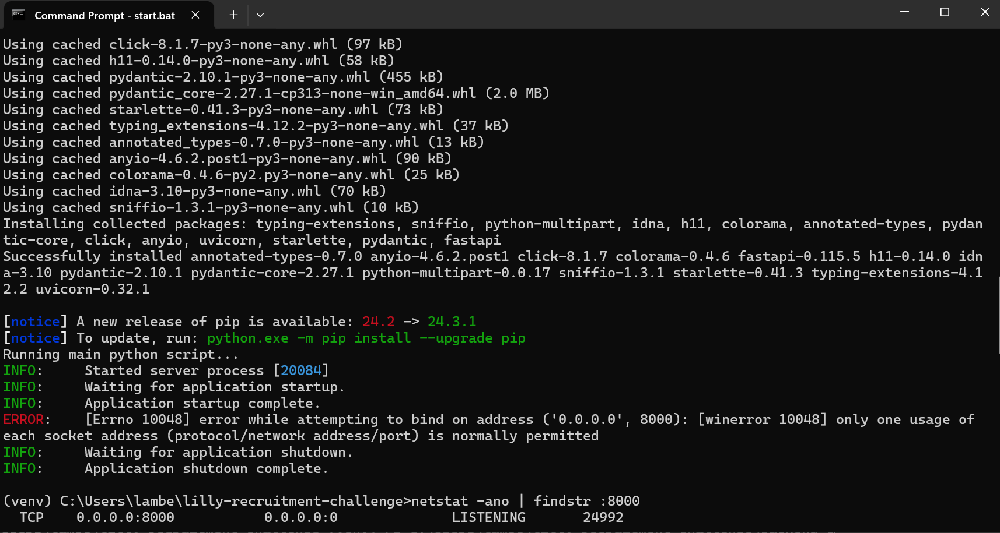
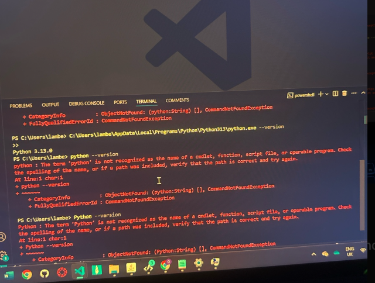

# Lilly Technical Challenge Documentation Template
# Finished Backend and Frontend Setup
 - prior to starting this project , i already had git, and visual studio installed 
 - I set up the Python virtual environment (venv) to manage the project's dependencies.
 - After that, I installed all the required packages by running pip install -r requirements.txt.
 - To ensure the backend was working correctly, I started the   server and checked that it was running successfully by visiting http://localhost:8000/medicines in my browser.
 - I also tested the frontend by opening the index.html file in my browser to confirm everything was loading as expected.
 - In the 2nd objective, in order to handle empty entries, I made it that if the medicine name is missing, empty, or even a whitespace, it would display "No Name". The same for the price, I added a logic that checks if it is greater than 0 (this is to help with validation), or if the price is invalid or missing, it shows "No Price". I also added checks to make sure that it doesn’t just accept values that are a string of spaces (.trim). I feel like they help to keep the table readable.i plan to viuslaly enhance the text so that the erros stand out in red.

***Not every section in this document is required. This is just a template to help get you started. Feel free to add or remove sections as you feel necessary.***

## Approach
*How did you approach this challenge? Did you work through the objectives in any particular order? If so, why? Did you utilize any external resources, such as tutorials, guides, or other materials?*
- i worked through the objectives in the order that it was written and made use of a few youtube videos as well as webiste like w3schools and mdn web docs 

## Objectives - Innovative Solutions
*For the challenge objectives, did you do anything in a particular way that you want to discuss? Is there anything you're particularly proud of that you want to highlight? Did you attempt some objectives multiple times, or go back and re-write particular sections of code? If so, why? Use this space to document any key points you'd like to tell us about.*

## Problems Faced
*Use this space to document and discuss any issues you faced while undertaking this challenge and how you solved them. We recommend doing this proactively as you experience and resolve the issues - make sure you don't forget! (Screenshots are helpful, though not required)*.
- one of the problems i faced was during my installation of python. it downloaded fine, but he terminal kept saying python was not recognised . i tried adding and removing it from the enviromental variables several times bit it still did not work.Another thing was that my terminal in vscode couldnt find the python path so i was stuck for while. it lead to me having duplicates of the ports. after trying  a lot of things i then switched to using cmd (Command Prompt) instead of VS Code to test if Python was properly installed. It worked there, so I realized the issue was with VS Code. Restarting VS Code finally solved the problem, and it recognized Python properly after that.
    i learned  that when dealing with enviromemtal variable changes that it is important to restart the IDE.    , ,
- i didnt really face any problems with first objective, only a mistake of my own doing where the tables in the index .html page was not showing but  that was only because i was using the wrong API endpoint in my fetch I used "http://localhost:8000/medicine" instead of "http://localhost:8000/medicines".After realizing the mistake, I corrected the endpoint in my JavaScript code, and the data loaded correctly. The frontend table started showing the medicines as expected.

## Evaluation
*How did you feel about the challenge overall? Did some parts go better than others? Did you run out of time? If you were to do this again, and were given more time, what would you do differently?*